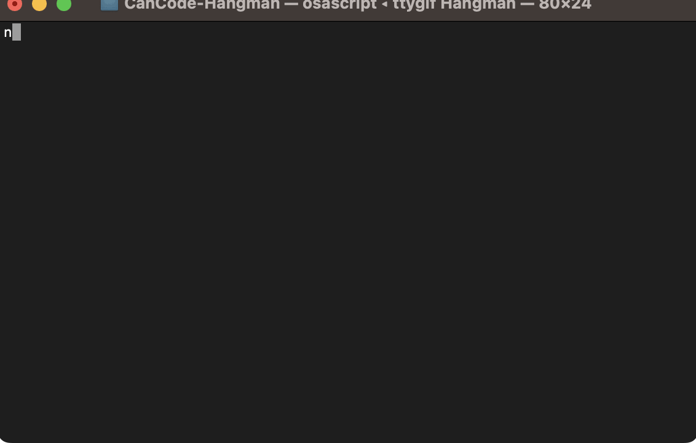

# CanCode-Hangman

A simple hangman game played in the terminal.

## Requirements

In order to run this program you will need Node.js

### Node

- #### Node installation on Windows

  Just go on [official Node.js website](https://nodejs.org/) and download the installer.

- #### Node installation on Ubuntu/MacOS

  You can install nodejs and npm easily with apt install, just run the following commands in your terminal.

      $ sudo apt install nodejs
      $ sudo apt install npm

- #### Other Operating Systems
  You can find more information about the installation on the [official Node.js website](https://nodejs.org/) and the [official NPM website](https://npmjs.org/).

## Downloading

If you are familiar with Git go ahead and clone this repository. Otherwise select the green "Code" button and click "Download ZIP". Once that has downloaded make a new folder and extract the contents of the zip into that folder

## Running the game

Open up a terminal and navigate to the root directory of this project. Before you run the program for the first time you will need to install all necessary dependencies by running the following command.

    $ npm install

Once those have installed run the following to play the game

    $ node .
